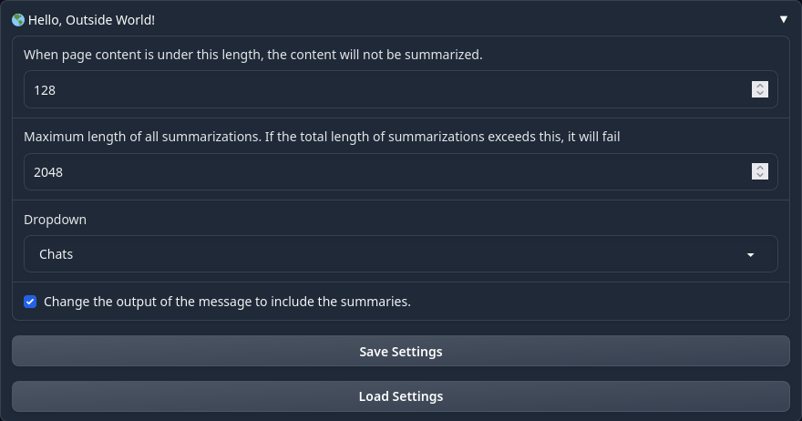

# 🌎 Hello, Outside World!


[text-generation-webui extension](https://github.com/oobabooga/text-generation-webui)
that parses any links and summarizes them, allowing the AI assistant to use the content
for answers.

Short web pages are not summarized.

If a link is invalid, then it remains in the chat, but is highligted red.

## Screenshots


## Installation

Assuming text-generation-webui is already set up, here is how to install the extension:

1. Clone the repo https://github.com/src-r-r/hello_outside_world into the directory `${TEXTGEN_ROOT}/extensions`

```shell
$ export TEXTGEN_ROOT=$HOME/text-generation-webui # or wherever text-generation-webui is installed
$ cd ${TEXTGEN_ROOT}/extensions
$ git clone https://github.com/src-r-r/hello_outside_world
```

2. Install the python packages in `requirements.txt` file with `${TEXTGEN_ROOT}/installer_packages/env/bin/python -m pip install -r ${TEXTGEN_ROOT}/installer`

```shell
$ ${TEXTGEN_ROOT}/installer_packages/env/bin/python -m pip install -r ${TEXTGEN_ROOT}/extensions/hello_outside_world
```

3. Enable `hello_outside_world` in Session.

4. Click "Apply flags/extensions and restart".

5. Profit!

## Usage example

Once "Hello, Outer World!" is installed, you should see the window in app settings:



**NOTE: Currently this feature is exprimental for notebook & default windows and will probably not work.**

## Development setup

Describe how to install all development dependencies and how to run an automated test-suite of some kind. Potentially do this for multiple platforms.

```sh
make install
npm test
```

## Release History

* 0.2.1
    * CHANGE: Update docs (module code remains unchanged)
* 0.2.0
    * CHANGE: Remove `setDefaultXYZ()`
    * ADD: Add `init()`
* 0.1.1
    * FIX: Crash when calling `baz()` (Thanks @GenerousContributorName!)
* 0.1.0
    * The first proper release
    * CHANGE: Rename `foo()` to `bar()`
* 0.0.1
    * Work in progress

## Meta

Your Name – [@DamnGoodTek](https://twitter.com/DamnGoodTek) – jordan@damngood.tech

Distributed under the XYZ license. See ``LICENSE`` for more information.

[https://github.com/src-r-r/hello_outside_world](https://github.com/dbader/)

## Contributing

1. Fork it (<https://github.com/yourname/yourproject/fork>)
2. Create your feature branch (`git checkout -b feature/fooBar`)
3. Commit your changes (`git commit -am 'Add some fooBar'`)
4. Push to the branch (`git push origin feature/fooBar`)
5. Create a new Pull Request